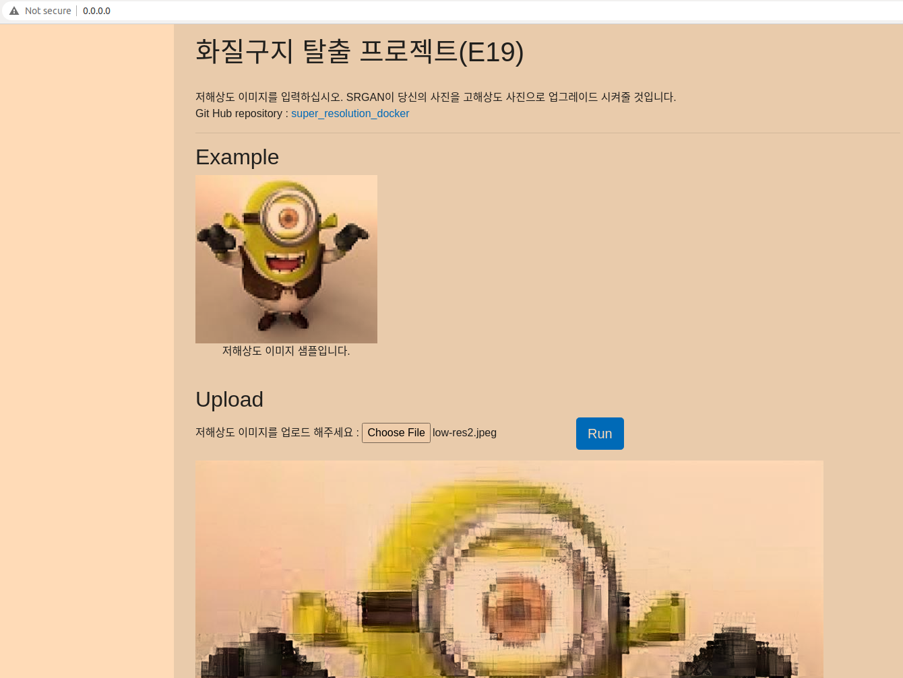
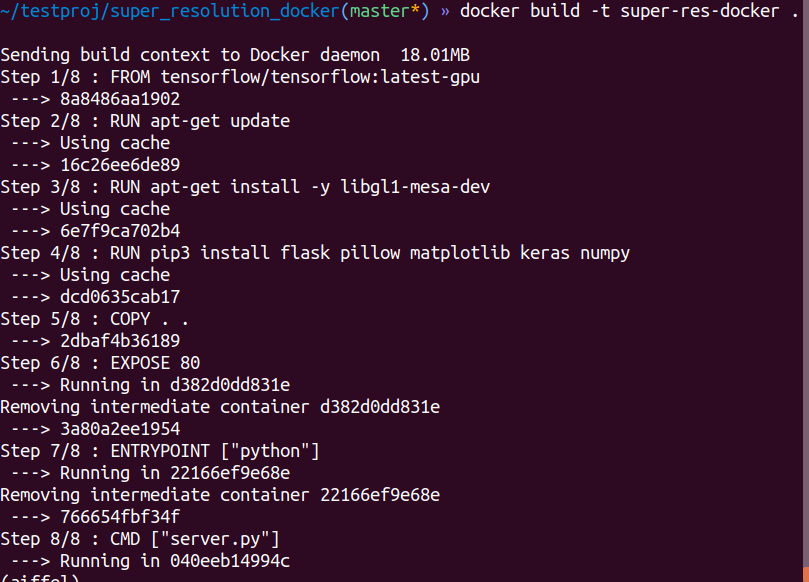

# E29 - docker + Ainize project
- E19 - SRGAN을 활용하여 저해상도 이미지를 고해상도로 변환하는 프로젝트   
      

    
## 루브릭
---
1. 로컬환경에서 정상수행     
    

2. 빌드 정상수행    
    
    
3. Run on Ainize - `no healthy upstream` 상태
    
    
## 빌드
---
### 빌드 명령어
`docker build -t super-res-docker .`
### 실행 명령어
`docker run -p 80:80 --gpus-all super-res-docker`
    

## 문제점
---
- 단 한번만 수행하고 다시 변환하고 싶다면 새로고침을 해야한다
- 테스트 환경 외 다른 환경에서 수행시 메모리부족 등의 이유로 터질 수 있는 불안정함 존재